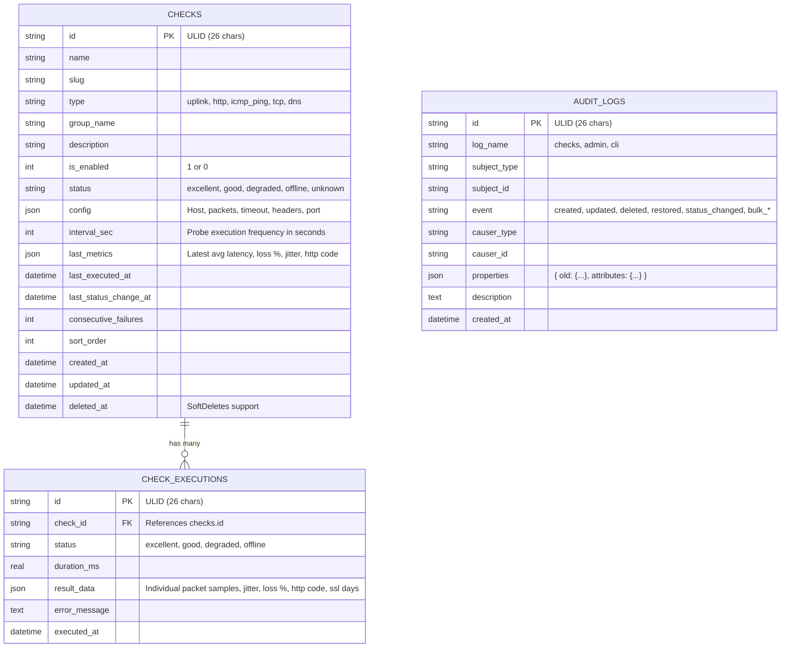

# System Architecture & Database Design

Homelab Uplink Monitor is built with an **API-first**, database-backed architecture using **ULID** primary keys, dynamic **JSON columns**, **Soft-Deletes**, and Spatie-style **Audit Logging**.

---

## Database Schema

Embedded **SQLite 3** with **WAL (Write-Ahead Logging)** mode and foreign keys enabled.

---

## Key Architectural Highlights

### 1. ULID Primary Keys
Every record generated in `checks`, `check_executions`, and `audit_logs` uses **ULID** (`Symfony\Component\Uid\Ulid`):
- 128-bit compatibility with UUID.
- 26-character URL-safe string format (e.g. `01M0ZS3TCFQ5XBAK01NSM2TE1Z`).
- Monotonically sortable by creation millisecond timestamp.

### 2. Type-Specific Dynamic JSON Columns
Instead of rigid tabular fields, both configuration and runtime results use JSON columns:
- **`checks.config`**: Stores target properties (`{"host": "1.1.1.1", "packets": 2, "timeout": 2, "provider": "Cloudflare Anycast"}`).
- **`check_executions.result_data`**: Stores full execution telemetry (`{"packets_sent": 2, "packets_received": 2, "packet_loss_percent": 0, "avg_latency_ms": 11.2, "jitter_ms": 1.2, "latencies": [11.2, 11.8]}`).

### 3. Infinite Telemetry Retention
Executions in `check_executions` are preserved indefinitely with indexed date-range querying, pagination, and statistical aggregators.

### 4. Soft-Deletes Support
Checks utilize soft deletion (`deleted_at IS NOT NULL`). Deleting a check moves it to the trash where it can be restored or permanently purged without breaking historical execution foreign keys.

### 5. Spatie-Style Activity & Audit Trail
Every lifecycle modification (creation, configuration edit, status change, enable/disable, soft deletion, and restoration) is recorded immutably in `audit_logs` with JSON state diffs.
